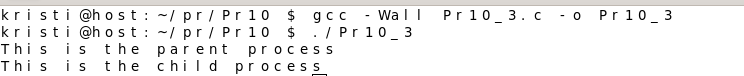
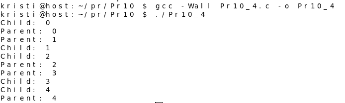
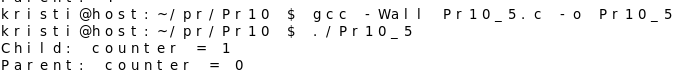
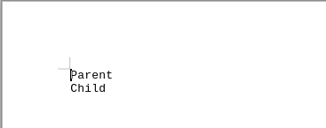
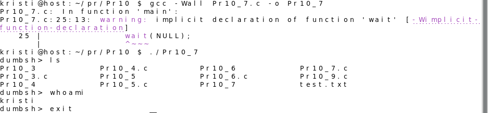
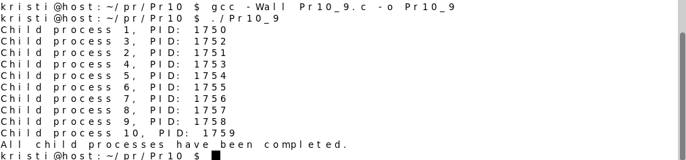

## Практична 10-11
###  3)Використання системного виклику fork
### [Код](Pr10_3.c)
## Результат компіляції

## Пояснення 
Ця програма  створює новий процес за допомогою fork(). Після виклику fork(), змінна pid містить ідентифікатор процесу дитини у батьківському процесі, а у дочірньому процесі вона дорівнює нулю. Далі код перевіряє значення pid: якщо воно менше нуля, виникла помилка при створенні процесу, і виводиться відповідне повідомлення. Якщо pid дорівнює нулю, це означає, що виконується дочірній процес, і він виводить відповідний текст. В іншому випадку виконується батьківський процес, який також виводить своє повідомлення. Таким чином, після запуску програми в терміналі можна побачити два повідомлення – одне від батьківського процесу, а інше від дочірнього.

---

### 4) Експеримент: імітація роботи в процесах
### [Код](Pr10_4.c)
## Результат компіляції

## Пояснення 
Ця програма створює новий процес за допомогою fork(), після чого визначає, який із них є батьківським, а який дочірнім. У дочірньому процесі запускається цикл, що виводить на екран п'ять рядків з написом "Child" і відповідним номером, роблячи паузу на одну секунду після кожного виводу. Тим часом у батьківському процесі виконується аналогічний цикл, але з повідомленням "Parent". У результаті, обидва процеси паралельно виводять свої повідомлення, поступово збільшуючи число в кожному рядку. Завдяки sleep(1), повідомлення з'являються із затримкою.

---

###  5)Копіювання даних при fork
### [Код](Pr10_5.c)
## Результат компіляції

## Пояснення 
Ця програма демонструє, як змінна counter поводиться у батьківському та дочірньому процесах. Спочатку counter дорівнює нулю, потім fork() створює новий процес. У дочірньому процесі значення counter збільшується на одиницю, і виводиться відповідне повідомлення. У батьківському процесі після затримки в одну секунду counter залишається незмінним і теж виводиться на екран. Оскільки обидва процеси мають свої власні копії змінної counter, зміна її значення у дочірньому процесі не впливає на батьківський, що показує принцип розділення пам’яті між процесами.

---

### 6)Процеси та відкриті файли
### [Код](Pr10_6.c)
## Результат компіляції

## Пояснення 
Ця програма демонструє, як батьківський і дочірній процеси взаємодіють з одним і тим самим файловим дескриптором. Спочатку відкривається файл test.txt для запису, а його дескриптор зберігається у змінній fd. Після виклику fork() створюється новий процес, який успадковує той самий дескриптор файлу. У дочірньому процесі в файл записується рядок "Child", тоді як батьківський процес записує "Parent". Обидва процеси використовують один файловий дескриптор, тому порядок запису може залежати від планування процесів. Завершуючи роботу, кожен процес закриває файл, звільняючи ресурс. 

---

### 7-8) Проєкт: Dumb Shell (DumbSH) -  Запуск dumbsh
### [Код](Pr10_7.c)
## Результат компіляції

## Пояснення 
Ця програма реалізує простий інтерпретатор командного рядка. Вона безперервно виводить запрошення dumbsh> і очікує введення команди. Якщо введено exit, цикл завершується, і програма завершує роботу. В іншому випадку виконується fork() для створення нового процесу. Дочірній процес використовує execlp() для виконання введеної команди, а в разі невдачі виводить повідомлення про помилку і завершується. Батьківський процес очікує завершення дочірнього, перш ніж продовжити приймати наступну команду. Таким чином, ця програма функціонує як дуже спрощена оболонка командного рядка.

---
### Варіант №9 Напишіть програму, яка створює 10 дочірніх процесів, зберігає їхні PID у масиві та чекає завершення кожного через wait().
### [Код](Pr10_9.c)
## Результат компіляції

## Пояснення 
Ця програма створює десять дочірніх процесів за допомогою fork(). Кожен процес отримує свій унікальний PID і виводить повідомлення про свій номер та ідентифікатор. Якщо fork() завершується помилкою, виводиться повідомлення про несправність. Батьківський процес продовжує виконання після створення всіх дочірніх процесів і використовує wait() для очікування завершення кожного з них. Після завершення всіх дочірніх процесів батьківський процес виводить повідомлення, що всі дочірні процеси завершені. 

