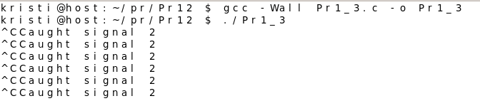
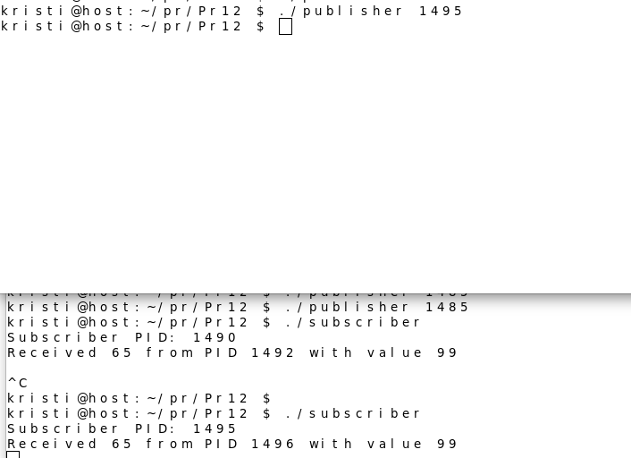

## Практична 12-13
###  3. Handling Signals
Обробка сигналів включає:
 - Встановлення обробника сигналу (signal handler), який викликається, коли процес отримує сигнал.
 - Використання функцій signal() або більш сучасної sigaction().
### [Код](Pr1_3.c)
## Результат компіляції

## Пояснення 
Ця програма встановлює обробник сигналу SIGINT, який спрацьовує, коли користувач натискає Ctrl+C. Функція handle_sigint() приймає сигнал і виводить повідомлення з його номером. В основній функції main() викликається signal(SIGINT, handle_sigint), що прив’язує обробник до сигналу. Далі програма запускає нескінченний цикл, який не виконує ніяких операцій, але утримує процес активним. Коли користувач натискає Ctrl+C, замість завершення роботи процесу викликається обробник handle_sigint(), який виводить повідомлення про отриманий сигнал. 
### 2. Trapping and Extracting Information from a Crash
Обробник сигналу з SA_SIGINFO отримує додаткову інформацію через siginfo_t:
### [Код](Pr2_1.c)
## Результат компіляції

## Пояснення 
Ця програма демонструє обробку сигналу SIGSEGV, який виникає при спробі доступу до недійсної адреси пам’яті. Встановлюється спеціальний обробник сигналу , який дозволяє отримувати додаткову інформацію про причину помилки. Коли виникає SIGSEGV, функція handler() виводить повідомлення про отриманий сигнал та адресу помилки, а потім завершує програму . У main() навмисно створюється ситуація, що викликає SIGSEGV, шляхом запису в нульовий покажчик , що призводить до аварійного завершення процесу та виклику встановленого обробника. 

### 10. Source Code (Збірка компонентів)
Обробник сигналу з SA_SIGINFO отримує додаткову інформацію через siginfo_t:
### [Код publisher](publisher.c)
### [Код subscriber](subscriber.c)
## Результат компіляції

## Пояснення 
Цей код реалізує механізм обміну сигналами між двома програмами — subscriber.c та publisher.c.
Програма subscriber.c налаштовує обробку сигналу SIGRTMIN за допомогою sigaction() і виводить повідомлення про отриманий сигнал, його відправника (PID процесу) і передане значення. Після запуску вона виводить власний PID і залишається в очікуванні сигналів, використовуючи pause().
Програма publisher.c приймає PID процесу підписника як аргумент командного рядка, після чого надсилає йому сигнал SIGRTMIN, передаючи додаткове значення 99 за допомогою sigqueue(). Таким чином, коли subscriber.c отримує цей сигнал, його обробник виводить відповідну інформацію, демонструючи передачу сигналу з даними між процесами.

### Варіант 9(Напишіть демон, який відстежує всі сигнали, що надходять до системи, і фіксує PID, UID, GID та ім’я процесу-відправника, використовуючи audit або netlink (якщо доступно).)
## Пояснення 
Спочатку була перевірка чи маю я audit на FreeBSD
```text
kristi @host:~ $ servise auditd onestat us 
sh: servise: not found 
kristi @host:~$ service auditd onestatus 
auditd is running as pid 740. 
kristi@host:~$ kldstat | grep audit 
kristi @host:~$ grep auditd_enable /etc/rc.conf 
auditd enable="YES"
```
І наче програма має працювати, але вона це працює, бо використовується бібліотека яка не застосовується у freeBSD. Тому шукаючи альтернативи, програма всерівно не хотіла компілюватись. Тому я вирішила взяти 8 варіант, аби показати засвоєння цієї теми.
### 8 Варіант(Напишіть програму, яка обробляє SIGINT або SIGTERM і використовує sigaltstack, щоб сигнал не завадив основному стеку.)


 
