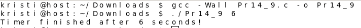

## Практична 14
###  Варіант 9 Реалізуйте CLI-таймер, який виводить повідомлення через рівно N секунд без використання сигналів (через clock_nanosleep()).
### [Код](Pr14_9.c)
## Результат компіляції

## Пояснення 
Ця програма реалізує таймер, який затримує виконання процесу на вказану кількість секунд. Спочатку перевіряється, чи користувач передав правильну кількість аргументів командного рядка.Якщо аргумент відсутній
або неправильний , виводиться повідомлення про помилку.Далі введене число перетворюється у long і використовується для заповнення структури timespec, що визначає час затримки.Функція 
clock_nanosleep здійснює очікування заданого інтервалу часу, використовуючи монотонний системний таймер. Якщо виклик clock_nanosleep() завершився помилкою, програма виводить 
повідомлення про несправність.Після завершення затримки програма повідомляє, що таймер завершився, і успішно завершує роботу. 
