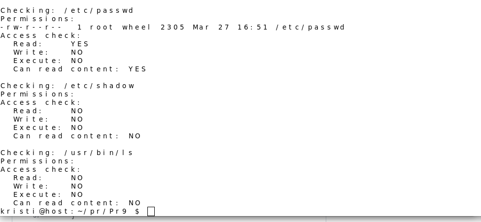

## Практична 9
###  Напишіть програму, яка читає файл /etc/passwd за допомогою команди getent passwd, щоб дізнатись, які облікові записи визначені на вашому комп’ютері.Програма повинна визначити, чи є серед них звичайні користувачі (ідентифікатори UID повинні бути більші за 500 або 1000, залежно від вашого дистрибутива), окрім вас.
### [Код](Pr9_1.c)
## Результат компіляції

## Пояснення 
Ця програма,за допомогою функції getuid() визначається ідентифікатор (UID) поточного користувача. Після цього, викликаючи функцію getpwuid(), програма отримує відповідну інформацію з бази даних користувачів, зокрема ім'я користувача. Якщо з якихось причин інформацію отримати не вдається, програма виводить повідомлення про помилку і завершується.Далі програма використовує функцію popen() для виконання зовнішньої команди getent passwd. Ця команда повертає всі записи з бази даних користувачів.Для кожного програма за допомогою fgets() читає дані, після чого застосовує функцію strtok(), щоб виділити окрему інформацію. Перша інформація містить ім'я користувача, друга—загальну інформацію, а третя  містить UID цього користувача. UID перетворюється у числове значення через atoi().Якщо числове значення UID більше 1000 і не співпадає з UID користувача, який запустив програму, інформація про такого користувача виводиться на екран. Таким чином, виключаються користувачі із малими UID та поточний користувач.

---

###  Напишіть програму, яка виконує команду cat /etc/shadow від імені адміністратора, хоча запускається від звичайного користувача.(Ваша програма повинна робити необхідне, виходячи з того, що конфігурація системи дозволяє отримувати адміністративний доступ за допомогою відповідної команди.)
### [Код](Pr9_2.c)
## Результат компіляції

## Пояснення 
Ця програма  намагається прочитати вміст файлу /etc/shadow, який доступний лише за root правами. Спочатку вона виводить повідомлення про спробу читання, а потім за допомогою функції system() виконує команду sudo cat /etc/shadow. Якщо виклик system() повертає -1, це означає, що сталася помилка при формуванні процесу виконання, і програма виводить повідомлення про помилку за допомогою perror(). Якщо функція повертає ненульовий код це свідчить про те, що команда була виконана, але завершилась помилкою (наприклад, через відсутність належних прав доступу). . Якщо ж команда виконується успішно, програма завершується з кодом 0.
Але дуже цікаво що коли програма скомпілювалась вивелось повідомлення "kristi is not in the sudoers file. This incident has been reported to the administrator , так як цього немає в моєму коді, можу тільки припустити що це повідомлення sudo.Коли я,тобто, "kristi" намагається виконати команду sudo cat /etc/shadow, система перевіряє файл для визначення прав доступу. Якщо «kristi» не внесена до цього файлу, то sudo відмовляє в доступі і генерує повідомлення.

---

###   Напишіть програму, яка від імені root копіює файл, який вона перед цим створила від імені звичайного користувача. Потім вона повинна помістити копію у домашній каталог звичайного користувача.  Далі, використовуючи звичайний обліковий запис, програма намагається змінити файл і зберегти зміни. Що відбудеться?  Після цього програма намагається видалити цей файл за допомогою команди rm. Що відбудеться?
### [Код](Pr9_3.c)
## Результат компіляції

## Пояснення 
Ця програма  намагається прочитати вміст файлу /etc/shadow, який доступний лише за root правами. Спочатку вона виводить повідомлення про спробу читання, а потім за допомогою функції system() виконує команду sudo cat /etc/shadow. Якщо виклик system() повертає -1, це означає, що сталася помилка при формуванні процесу виконання, і програма виводить повідомлення про помилку за допомогою perror(). Якщо функція повертає ненульовий код це свідчить про те, що команда була виконана, але завершилась помилкою (наприклад, через відсутність належних прав доступу). . Якщо ж команда виконується успішно, програма завершується з кодом 0.
Але дуже цікаво що коли програма скомпілювалась вивелось повідомлення "kristi is not in the sudoers file. This incident has been reported to the administrator , так як цього немає в моєму коді, можу тільки припустити що це повідомлення sudo.Коли я,тобто, "kristi" намагається виконати команду sudo cat /etc/shadow, система перевіряє файл для визначення прав доступу. Якщо «kristi» не внесена до цього файлу, то sudo відмовляє в доступі і генерує повідомлення.

---

###  Напишіть програму, яка по черзі виконує команди whoami та id, щоб перевірити стан облікового запису користувача, від імені якого вона запущена Є ймовірність, що команда id виведе список різних груп, до яких ви належите. Програма повинна це продемонструвати.
### [Код](Pr9_4.c)
## Результат компіляції

## Пояснення 
Ця програма,виконує команди whoami та id, щоб отримати інформацію про поточного користувача. Спочатку вона виводить текст "whoami:" і виконує команду whoami, яка повертає ім'я користувача, під яким запущена програма. Якщо виконання команди завершується помилкою, програма повідомляє про це та завершується. Потім вона виводить "id:" і викликає команду id, яка показує UID (ідентифікатор користувача), GID (ідентифікатор групи) та список груп, до яких належить користувач. У разі помилки виконання id програма також повідомляє про це і завершується. Якщо обидві команди виконуються успішно, програма завершує роботу без помилок.

---

###  Напишіть програму, яка створює тимчасовий файл від імені звичайного користувача. Потім від імені суперкористувача використовує команди chown і chmod, щоб змінити тип володіння та права доступу.Програма повинна визначити, в яких випадках вона може виконувати читання та запис файлу, використовуючи свій обліковий запис.
### [Код](Pr9_5.c)
## Результат компіляції

## Пояснення 
Ця програма визначається ім'я файлу `testfile.txt`. Програма відкриває його у режимі запису  і записує текст. Після цього файл закривається.
Далі виконується команда `sudo chown root testfile.txt`, яка змінює власника файлу на `root`. Якщо ця команда не виконується, програма повідомляє про помилку. Далі зміна прав доступу (`chmod 600`), що дозволяє тільки власнику читати й записувати файл. Після зміни власника та прав доступу викликається функція `check_file_access()`. Вона перевіряє, чи можна читати  або записувати файл. Якщо файл недоступний, виводиться  повідомлення. Програма виконує команду `sudo rm testfile.txt`, видаляючи файл. Якщо видалення не вдається, з’являється повідомлення про помилку.
Але щоб скомпілювати програму виникли помилки перша компіляція виглядає так:
```text
The user`s UID:1001
Password: 
kristi is not in the sudoers file. 
This incident has been reported to the administrator.
```
Тобто у висновку я не маю права. Далі виникла складність змінити ці права,бо їх потрібно було змінити у visudo, але треба було розібратись як правильно вписати, ось результати 
- visudo
  
  

- перевірка на те чи є права
  
 

Але виникає нова помилка яку треба виправити у коді


При виправленні вже програма має працювати


І вона працює але каже, що я немаю доступу до прав.

---

###  Напишіть програму, яка виконує команду ls -l, щоб переглянути власника і права доступу до файлів у своєму домашньому каталозі, в /usr/bin та в /etc. Продемонструйте, як ваша програма намагається обійти різні власники та права доступу користувачів, а також здійснює спроби читання, запису та виконання цих файлів..
### [Код](Pr9_6.c)
## Результат компіляції


## Пояснення 
Ця програма  перевіряє доступ користувача до важливих системних файлів. Спочатку вона виводить список файлів у домашній директорії користувача, потім у /usr/bin, де розташовані системні утиліти, і /etc, де знаходяться конфігураційні файли операційної системи.Після цього програма перевіряє права доступу до файлу. Вона використовує функцію access(), щоб визначити, чи можна читати, записувати або виконувати файл, а також перевіряє, чи його можна відкрити на читання через fopen(). Виводиться детальний звіт про те, чи доступний файл, а також його права доступу.Програма аналізує три ключові файли: /etc/passwd, який містить список користувачів системи, /etc/shadow, де зберігаються паролі в зашифрованому вигляді, і /usr/bin/ls, що відповідає за виконання команди ls. Якщо якийсь файл недоступний, виводиться відповідне повідомлення.
